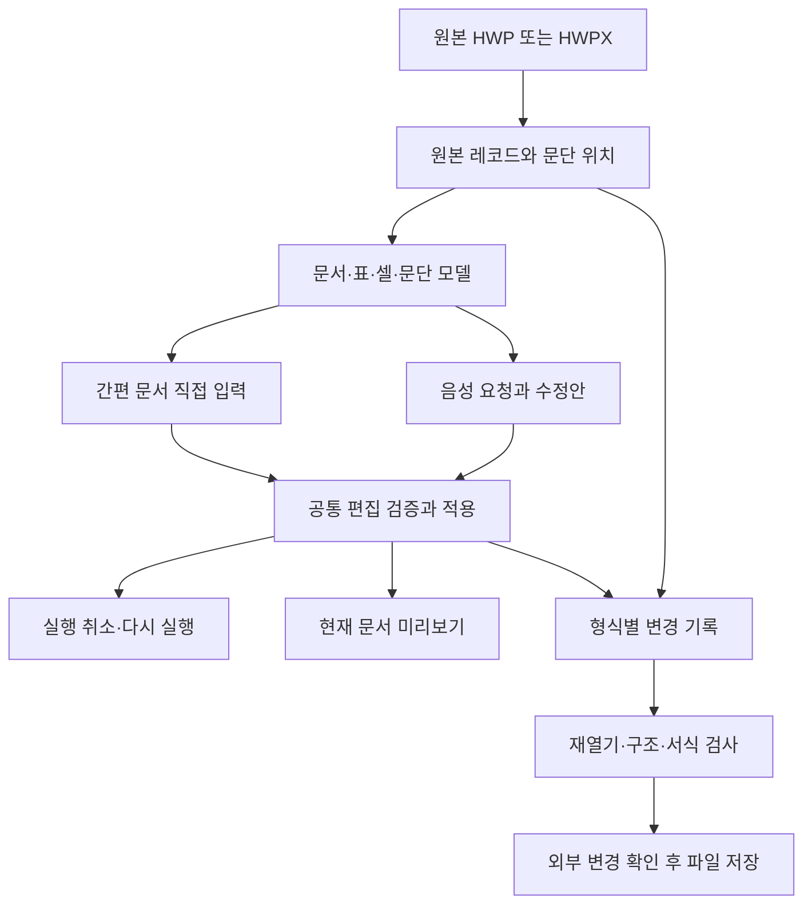

# HWP 신청서 편집기 설계

작성: 2026-09-08 · 상태: 첫 입력·HWP 저장과 항목 이름을 이용한 수정 대상 연결 구현 · 기기 검증 대상: iPad Pro M4

후속 단계로 원본뷰의 문단 내 커서·선택·직접 입력을 연결했다. 현재 범위와 남은 전체 문서 편집 작업은 [원본 커서 편집 구현 기록](HWP_INLINE_EDITOR_IMPLEMENTATION_20260908.md)을 참조한다.

첫 구현의 변경 범위와 검증 결과는 [구현 기록](HWP_FORM_EDITOR_IMPLEMENTATION_20260908.md)에 정리했다. 아래 1절은 구현 전 진단이며, 나머지는 전체 편집기로 확장하기 위한 설계이다. 실기기와 외부 한컴 앱 검증은 아직 남아 있다.

후속 구현으로 C의 항목 이름·초점 연결과 D의 HWP 명령 제한·레이블 문맥·수정 대상 검증을 붙였다.
여러 서식의 위치 매핑과 여러 줄 배치, 실제 음성/클라우드 응답을 포함한 실기기 검증은 계속 후속 범위이다.

목표는 기존 HWP 신청서의 제품명·출품자·소속·연락처·주소를 직접 또는 말로 입력하고, 원래의 표와 서식을 유지한 HWP로 저장하는 것이다. 먼저 기존 양식을 작성할 수 있게 하고, 표 구조를 새로 만드는 편집은 후속 단계로 둔다.

## 1. 구현 전 실제 파일에서 확인한 문제

기준 파일: `05_한글활용디자인공모전_신청서.hwp`.
파일 식별 정보와 원시 레코드 진단은 [진단 자료](HWP_FORM_EDITOR_EVIDENCE_20260908.json)에 저장했다.

| 항목 | 확인 결과 |
| --- | --- |
| 표 / 표 안 문단 | 4개 / 89개 |
| 화면상 빈 표 문단 | 46개 |
| 텍스트 레코드가 없는 빈 문단 | 41개 |
| 공백 문자와 문단 끝 문자가 있는 문단 | 3개 |
| 글자 대신 내부 표의 컨트롤이 들어 있는 문단 | 2개 |

41개는 입력 항목 41개라는 뜻이 아니다. 같은 셀 안의 여백용 빈 문단도 포함한다. 이 41개에서 파서의 문서 편집 허용 여부는 true이고 복합 컨트롤·위치 메타데이터 플래그는 false였다. OLE 본문을 따로 읽어 모두 `PARA_TEXT` 레코드가 없다는 것도 확인했다.

현재 파서는 `!textUnits.isEmpty`를 편집 조건으로 요구한다. 저장기는 기존 `PARA_TEXT`를 만나야 내용을 교체하고 적용 완료로 기록한다. 따라서 빈칸을 편집 가능으로 바꾸는 것만으로는 저장할 수 없다. **빈 문단 판정과 텍스트 레코드 생성 기능을 함께 구현해야 한다.**

또한 참가형태·응모분야의 부모 문단 2개에는 8개 UTF-16 단위의 표 컨트롤과 문단 끝 문자가 있다. 현재는 이 문단들의 편집 허용 플래그도 true이다. 이를 일반 빈칸처럼 교체하면 내부 표 연결을 잃을 가능성이 있으므로, 원시 토큰을 기준으로 별도 분류해야 한다. 이번 진단에서 해당 문단을 실제로 덮어쓰는 실험은 하지 않았다.

코드 근거:

- `HWP5StructuredDocumentParser.swift`: `ParagraphBuilder.makeBlock`, `installText`, `installCharacterShapes`.
- `HWP5DocumentRewriter.swift`: `rewriteSection`, `appliedOrdinals`, `adjustedCharacterShapes`.
- `HWPDocumentView.swift`: `convertLegacyForEditing`, `applyTableRowEdits`, `applyAIPlan`.

## 2. 제품 범위와 기본 동작

| 단계 | 사용자에게 제공할 동작 | 완료 기준 |
| --- | --- | --- |
| 1. 빈칸 입력·저장 | 제품명 등 기존 빈 문단에 입력, 지우기, 다시 입력, HWP 저장 | 텍스트가 없던 문단을 생성해 저장하고 재열기·재편집 가능 |
| 2. 신청서 편집 | 항목 이름으로 셀 찾기, 여러 항목 편집, 문단별 서식 유지, 긴 입력의 배치 처리 | 선택한 입력란과 수정된 결과가 일치하고 입력이 잘리거나 겹치지 않음 |
| 3. 음성 연결 | “출품자 1 이름을 홍길동으로” 같은 요청 | 직접 입력과 동일한 편집 결과, 검증, 실행 취소, 저장 동작 |
| 4. 편집 범위 확장 | 글자·문단 서식 변경, 셀 안 문단 추가·삭제, 선택 항목 | 각 동작의 저장·재열기 호환성 검사 후 개별 활성화 |

표 행·열 추가/삭제, 병합 변경, 그림·도형·수식 편집, 전체 문서 자동 조판은 별도 후속 작업이다. 각 기능은 지원되는 파일 형식과 대상에만 제공한다.

기본 저장 형식은 입력 파일과 같다. 현재 `convertLegacyForEditing`은 모든 블록의 텍스트를 이어 새 HWPX를 만드는 방식이므로, 신청서 편집의 선행 단계로 사용하지 않는다. 구조와 서식을 보존하는 변환은 독립 과제로 다룬다.

## 3. 편집 가능한 대상을 구체적으로 구분

현재의 `isEditable` 하나를 내부적으로 다음 판정으로 확장한다. 기존 화면은 우선 이 판정에서 계산한 `isEditable`을 사용해 점진적으로 전환한다.

| 판정 | 의미 | 첫 단계 처리 |
| --- | --- | --- |
| `existingText` | 교체 가능한 기존 텍스트 문단 | 기존 경로 유지, 컨트롤 토큰 재검증 |
| `emptyParagraph` | 문단 헤더와 서식은 있으나 텍스트 레코드가 없음 | 검증 후 텍스트 레코드 생성 |
| `container` | 내부 표·개체의 연결을 소유하는 문단 | 내부 셀로 이동; 부모 문단 전체 교체는 제공하지 않음 |
| `positionedContent` | 필드·범위 태그 등 위치 갱신이 필요한 문단 | 해당 기능의 작성기 구현 전에는 읽기 전용 |
| `protectedDocument` | 문서 자체의 보호 상태 | 기존 보호 처리 유지 |
| `unsupportedStructure` | 잘못된 참조·알 수 없는 레코드 구조 등 | 원인과 함께 해당 대상만 읽기 전용 |

판정 입력에는 실제 레코드 유무, 문단 소유 범위, 원시 텍스트 토큰, 글자 모양 참조, 위치 메타데이터를 포함한다. `text.isEmpty`, 화면상 공백 여부, 기존 복합 개체 플래그 하나만으로 판정하지 않는다.

이번 파일에서 확인된 41개는 `emptyParagraph` 후보이다. 문단 끝 표시, 서식 참조, 레코드 소유 관계 검사를 통과한 대상만 연다. 2개의 내부 표 부모 문단은 `container`로 분리한다.

## 4. 데이터와 저장 구조



원본 바이트와 편집용 모델을 함께 보관한다. 화면에 필요한 정보만 추출한 뒤 전체 문서를 재생성하지 않는다.

추가할 정보:

- `HWPParagraphSource`: 구역 경로, 문단 헤더 레코드 위치와 level, 소유 레코드 범위, 원본 지문, 텍스트 레코드 유무, 원래 글자 모양 참조, 원시 토큰.
- `HWPEditCapability`: 가능한 작업과 제한 이유. 파서·화면·직접 편집·AI·저장기가 같은 판정을 사용한다.
- `HWPTextEdit`: 대상 문단, 예상 원문과 revision, 새 텍스트 또는 텍스트 범위 변경.
- `HWPEditTransaction`: 변경 집합과 이전/이후 상태. 행 단위 입력과 AI 요청 하나가 각각 실행 취소 한 번의 단위가 된다.
- `HWPFormField`: 표시 이름, 셀·문단 ID, 실제 레이블 근거, 상위 표·행 문맥, 편집 가능 작업.

초기 단계에는 기존 블록 ID를 유지하고 소스 위치를 보조 정보로 붙인다. 레코드 삽입 후에는 바이트 위치가 달라지므로 저장·재열기 때 소스 위치를 다시 구축한다. 문단 번호나 저장 이전의 바이트 오프셋만으로 다음 편집을 적용하지 않는다.

## 5. 첫 구현: 없는 PARA_TEXT를 생성

빈 문단의 목표 형태는 기존 헤더·서식·배치 레코드 사이에 텍스트만 생기는 것이다.

```text
입력 전: PARA_HEADER → PARA_CHAR_SHAPE → PARA_LINE_SEG
입력 후: PARA_HEADER → PARA_TEXT → PARA_CHAR_SHAPE → PARA_LINE_SEG
```

세부 동작:

1. 먼저 문단 헤더와 그 문단이 직접 소유한 레코드 구간을 찾는다. 중첩 표의 자식 문단 경계와 혼동하지 않는다.
2. 저장 직전에도 원본 지문과 편집 capability를 재검증한다.
3. 기존 `PARA_TEXT`가 있으면 교체한다. 없으면 문단의 올바른 자식 level과 순서에 새 레코드를 한 번만 삽입한다. 새 문단이나 새 셀을 만드는 작업은 아니다.
4. 텍스트를 UTF-16 단위로 기록한다. 현재 지원하는 탭·줄바꿈 인코딩과 문단 끝 표시를 공통 함수로 사용한다.
5. 문단 헤더의 글자 수는 상위 플래그와 분리해 계산하고, 기존 상위 플래그를 보존한다. 토큰을 포함하는 원시 길이와 사용자에게 보이는 글자 수를 구분한다.
6. 원래 글자 모양 참조를 보존한다. 빈 문단의 입력 서식은 위치 0의 글자 모양 → 유효한 문단 스타일 참조 순서로 결정한다. 임의의 기본 글꼴로 바꾸지 않는다.
7. 편집용 모델에도 이 입력 서식을 보관한다. 지금처럼 텍스트 run이 없다고 서식 없는 새 run을 만드는 경로를 보완해 화면과 저장 결과가 같게 한다.
8. 변경 문단의 줄 배치 캐시와 헤더의 줄 개수를 일치시키고, 글자가 생긴 줄에는 빈 줄 표시가 남지 않게 한다.
9. 텍스트 레코드를 만든 문단도 적용 완료 집합에 포함한다. 두 번째 저장에서는 기존 레코드를 교체해 중복 삽입을 막는다.
10. 원본 문단·셀·표의 수와 ID, 병합 구조, 내부 표 연결, 관련 없는 레코드가 유지됐는지 검증한다.

문단 헤더·텍스트·글자 모양·배치 캐시의 역할과 위치 0 서식 조건은 [한컴 공개 HWP 5.0 규격 revision 1.3, 4.3.1–4.3.5](https://cdn.hancom.com/link/docs/%ED%95%9C%EA%B8%80%EB%AC%B8%EC%84%9C%ED%8C%8C%EC%9D%BC%ED%98%95%EC%8B%9D_5.0_revision1.3.pdf)에 근거한다. 삽입기와 검증 단계의 구성은 이 프로젝트에 대한 설계 제안이다.

## 6. 서식과 배치의 보존 범위

보존 대상은 글꼴·크기·색·문단 정렬·표 열 너비·셀 병합·테두리·배경·개체 연결이다. 내용이 길어져 발생하는 자연스러운 줄바꿈과 행 높이 변화는 별도로 계산한다.

현재 화면은 `HWPTextRunEditing.redistribute`로 변경 글자의 서식을 배분하지만, HWP 저장기는 글자 모양 위치를 최대 길이에 맞추는 방식이다. 일반 문장 중간의 삽입·삭제까지 지원하려면 **같은 텍스트 변경 정보로 화면 run과 저장 위치를 함께 계산**해야 한다. 첫 단계의 빈 문단 입력은 기존 위치 0의 서식을 그대로 쓰는 좁은 경로로 시작한다.

셀 안 여러 문단은 각각 유지한다. 행 편집창의 모든 값을 하나의 문단으로 합치지 않는다. 첫 단계에서 Enter는 지원되는 문단 내부 줄바꿈으로 처리하고, 실제 문단 분리·병합은 후속 명령으로 구분한다.

배치 갱신 순서는 변경 문단의 줄 → 병합 셀을 포함한 행 높이 → 상위 중첩 표 → 뒤따르는 내용이다. `HWPTextRunEditing`, `HWPFlowLayout`, 원본 캔버스의 표 높이 계산을 점검해 재사용한다. 기존 구현이 전체 페이지 조판을 완성했다고 가정하지 않는다.

1차 완료 검사는 기존 칸에 들어가는 짧은 값으로 한정한다. 주소 등 여러 줄 입력은 2차 완료 기준에 포함한다. 지원 범위를 넘어가는 배치에서는 입력 초안을 유지하고 넘침 위치를 표시한다. 글꼴을 몰래 줄이거나 내용을 잘라 저장하는 방식은 사용하지 않는다. 해당 배치의 저장 지원은 재열기·외부 렌더링 검증을 통과한 뒤 활성화한다.

## 7. 간편 문서와 입력 흐름

표·행별 보기를 유지하면서 입력창의 이름을 `2열`에서 `출품자 1 · 성명`, `출품자 2 · 연락처`처럼 개선한다. 이 이름은 문서에서 확인한 레이블과 셀 관계로 만들고, 원래 표·행·열 위치도 함께 제공한다.

- 한 행의 레이블과 입력칸을 함께 보여주되, 레이블 글자와 입력 값을 구분해 선택할 수 있게 한다.
- 반복되는 연락처·이메일은 출품자 구역 문맥을 포함한다. 관계를 확정할 수 없으면 좌표 이름을 유지한다.
- 내부 표가 있는 셀은 빈 입력칸으로 표시하지 않고 내부 항목으로 이동하게 한다.
- 읽기 전용 셀을 누르면 제한 이유를 알려준다. 문서 보호와 아직 지원하지 않는 구조를 같은 이유로 표시하지 않는다.
- 여러 문단이 있는 셀은 문단별 초안을 유지한다. 적용할 때 바뀐 문단만 하나의 transaction으로 반영한다.
- 편집 초점은 셀·문단 ID로 관리한다. 사용자가 빈칸에 초점을 맞추면 AI에도 그 입력칸을 전달한다.
- VoiceOver는 항목 이름, 현재 값/빈칸, 편집 가능 여부, 병합 범위를 읽고 적용 후에는 편집한 위치로 돌아온다.

개인/단체 같은 선택 항목을 무조건 체크박스로 추측하지 않는다. 실제 양식 컨트롤, 글자 기호, 단순 빈 셀을 구분하고 저장 방법을 검증한 유형부터 선택 UI를 붙인다.

## 8. 직접 입력과 음성 입력의 공통 경로

두 입력 방식 모두 `prepare → validate → apply → undo/redo → save`를 사용한다. 음성 경로만 원본 파일을 직접 쓰거나 별도 문자열 치환기를 사용하지 않는다.

첫 음성 지원은 단일 문단 입력칸의 값 변경이다. 예: “출품자 1을 홍길동으로 바꿔 줘” → 해당 입력칸 ID와 값 → 로컬 편집기로 전달. `initializeEmptyParagraph` 같은 파일 내부 작업은 로컬 작성기가 결정하고 AI에게 맡기지 않는다.

AI 문서 정보에는 빈칸, 원본 셀 위치, 상위 표 경로, 주변 레이블, 현재 초점, 지원 가능한 명령을 넣는다. 간편 보기의 표 번호와 AI가 보는 표 번호도 같은 모델에서 만든다. 같은 이름의 입력칸이 여러 개면 현재 초점이나 명시된 출품자 번호로 좁히고, 여전히 여러 대상이면 한 가지 질문으로 확인한다.
공용 Word 스키마의 `setStyle`을 그대로 노출하는 현재 불일치를 해소한다. HWP가 실제로 적용할 수 있는 작업만 응답 스키마·프롬프트·검증기에 제공한다. 요청당 제한, 현재 revision 검사, AI 수정안 미리보기/적용 흐름은 유지한다.

## 9. 저장과 검증

변경된 구역만 다시 작성한다. 이번 단계에서 관련 없는 `DocInfo`, `BinData`, 표/셀 구조 레코드, 다른 구역은 논리 데이터 기준으로 동일해야 한다. OLE 컨테이너의 파일 전체 바이트가 같아야 한다는 의미는 아니다. `PrvText`와 변경 문단의 배치 캐시는 명시적으로 갱신 가능한 파생 데이터로 분리한다. 미리보기 이미지가 있는 경우의 갱신/무효화 처리는 별도 호환성 확인 항목으로 남긴다.

저장 검증은 다음 세 층으로 진행한다.

1. **편집·재열기:** 빈칸 입력 → 저장 → 닫기 → 다시 열기 → 수정 → 저장. 지우기·재입력, 한글/숫자/이모지/탭/줄바꿈, 여러 셀 변경, 실행 취소/다시 실행 포함.
2. **원본 구조 비교:** 표 수·행/열·병합·셀 문단·컨트롤 연결·서식 참조·그림 데이터 보존. 문단의 예상 위치에 텍스트가 하나만 생성됐는지 검사. 편집 대상 외의 레코드 변경은 허용 목록과 대조.
3. **외부 호환성:** 한컴 한글에서 수정본을 열어 복구 안내 없이 표시되는지 확인하고 기준 PDF/출력과 비교. 앱의 작성기와 파서가 같은 오류를 공유할 수 있으므로 내부 재열기만으로 완료 처리하지 않는다.

원본 파일의 외부 변경 검사와 원자적 교체는 기존 저장 계층을 사용한다. 저장 실패 시 편집 상태와 실행 취소 기록을 보존한다. 입력 완료와 파일 저장 완료를 화면에서 구분한다.

기기 검증 대상은 사용자가 정정한 **iPad M4**이다. 확인된 대상 기기에서 실행하며, 대화 중에 M5로 임의 설치하지 않는다.

## 10. 구현 순서

| 작업 묶음 | 주요 변경 | 통과해야 할 검사 |
| --- | --- | --- |
| A. 진단과 회귀 기준 | 실제 신청서의 빈 문단·원시 토큰·서식 참조를 고정 fixture로 검사 | 41개 텍스트 미생성 문단과 2개 내부 표 부모 문단을 구별 |
| B. 빈 문단 쓰기 | 파서의 입력 서식 보존, 소스 위치, 원시 토큰 capability, `PARA_TEXT` 삽입, 헤더·캐시 갱신 | 제품명 입력·저장·재열기·재편집; 원래 4개 표와 병합/내부 표 유지 |
| C. 직접 입력 완성 | 항목 이름·초점 연결, 여러 값 transaction, run 위치 매핑, 여러 줄 배치 | 출품자·소속·연락처·주소 작성과 외부 프로그램 재열기 |
| D. 음성 연결 | HWP 지원 명령 스키마, 빈칸/레이블 문맥, 직접 입력과 공통 transaction | 동일 값의 직접 입력·음성 입력 결과와 저장 구조 일치 |

첫 구현 범위는 A+B로 정한다. 실제 파일에서 텍스트 레코드가 없던 **제품명 칸에 값을 입력하고 HWP로 저장한 뒤 다시 편집할 수 있는 것**을 첫 시연으로 삼는다. C+D가 완료되면 신청서 직접 작성과 음성 작성의 기본 경로가 완성된다.

## 11. 참고 자료와 남은 확인

- [한컴 HWP/OWPML 공개 규격 안내](https://online.hancom.com/support/downloadCenter/hwpOwpml)
- [한컴의 HWP 본문·문단 구조 설명](https://tech.hancom.com/python-hwp-parsing-2/)
- 원본 글자 모양 정보가 없는 빈 문단의 유효한 대체 서식 규칙은 별도 fixture로 확인한다. 이번 41개에는 글자 모양 레코드가 존재한다.
- 텍스트와 컨트롤이 섞인 문단의 범위 편집, 실제 양식 컨트롤 작성, 전체 쪽 배치는 첫 구현의 검증 범위에 포함하지 않는다.
- 이 문서는 설계이며 편집기 구현 완료를 의미하지 않는다. 이번 작업에서는 앱 편집 코드를 변경하지 않고 읽기 진단과 설계만 수행했다.
